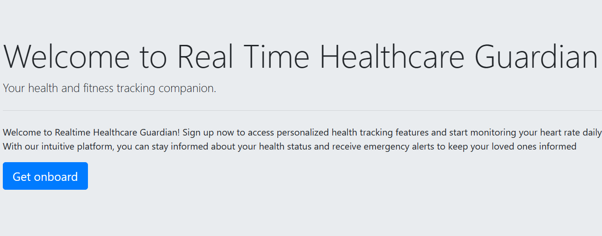
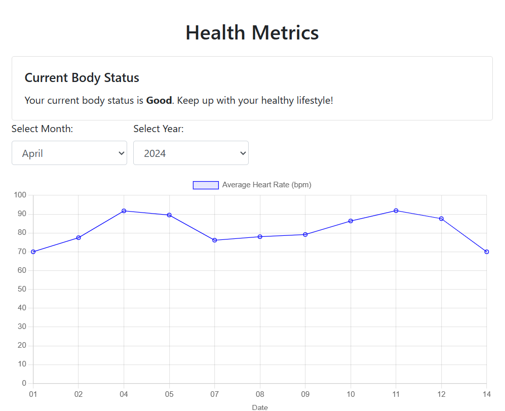

# Realtime Healthcare Guardian

Realtime Healthcare Guardian is a sophisticated application designed for personalized heart rate monitoring and emergency alerting. It leverages wearable technology and cloud-based infrastructure to provide real-time insights into individuals' heart rates and send immediate alerts to designated family members in case of detected abnormalities.




## Project URL
[https://realtime-health-guardian.onrender.com]

## Features

- Real-time heart rate monitoring using compatible wearable devices.
- Family member management for designated emergency contacts.
- Historical data analysis for long-term health trends.
- Recommendations for medical consultation based on detected abnormalities.

## Installation

1. Download the Google fit application in your mobile.
2. Install the application on your mobile device.
3. Follow the on-screen instructions to set up your account and authenticate with Google Fit.
4. Connect your compatible wearable device to the application for heart rate monitoring.
5. Sign up to realtime health guardian
6. Authenticate to your google fit account

### Follow Onboarding processs as below
[https://realtime-health-guardian.onrender.com/onboarding]

## Usage

1. **Sign Up**: Create an account using your email address and set up your profile.
2. **Connect Wearable Device**: Connect your compatible wearable device to the application for heart rate monitoring.
3. **Set Emergency Contacts**: Specify designated family members to receive emergency alerts.
4. **Monitor Health**: View real-time heart rate data and monitor health trends.
5. **Receive Alerts**: Receive immediate alerts in case of detected abnormalities in heart rate patterns.
6. **Review Historical Data**: Analyze historical heart rate data to track long-term health trends.


## Google Collab Heart Rate Analysis 
[https://colab.research.google.com/drive/1cjEIbAJDo04KRP-jyzF_kpv1nOBlb5Yf?usp=sharing]

## To deploy the Realtime Healthcare Guardian application, follow these steps:

1. Clone the repository:

  ```bash
  git clone https://github.com/sachinmoze/realtime-health-guardian.git
  ```

2. Install the required dependencies:

  ```
  pip install -r requirements.txt
  ```

3. Configure the environment variables:

  Create a `.env` file in the root directory of the project and add the following variables:

  ```plaintext
      SECRET_KEY 
      MAIL_SERVER
      MAIL_PORT=2525
      MAIL_USERNAME
      MAIL_PASSWORD
      MAIL_USE_TLS
      MAIL_USE_SSL
  ```

4. Start the application:

  ```bash
  python app.py
  ```

5. Access the application:

  Open your web browser and navigate to `http://localhost:8080`.


## Roadmap

Here are some planned features for future releases of the Realtime Healthcare Guardian application:

- Integration with additional wearable devices.
- Enhanced data analysis and visualization.
- Add sequantial modeling machine learning algorithm to detect heart rate abnormalities for future days
- Emergency Alert send

Please note that the roadmap is subject to change and not all features may be implemented.

## Support

For any inquiries or support requests, please contact at [sachinmoze@gmail.com](mailto:sachinmoze@gmail.com).

## License

This project is licensed under the [MIT License](LICENSE.md). See the [LICENSE.md](LICENSE.md) file for details.

## Version History

- **Version 1.0.0** (Release Date: 04/15/2024):
  - Initial release of the Realtime Healthcare Guardian application.
  - Basic features include real-time heart rate monitoring.


